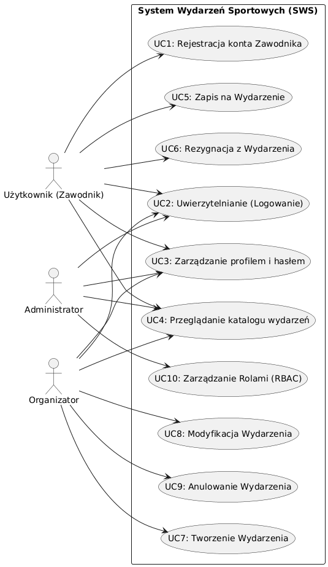
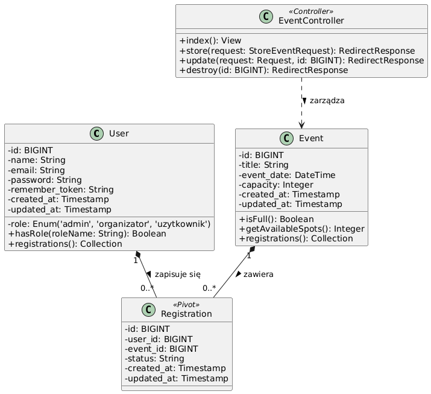

## 1. Strona Tytułowa [SŻ]
**Dokumentacja Projektu: System Wydarzeń Sportowych (SWS)**
**Autor:** Sebastian Żaczkiewicz
**Link do repozytorium:** https://github.com/SebZak00/sws-projekt
**Wersja Live:** Brak (Środowisko deweloperskie)

## 2. Słownik pojęć [SŻ]
* **Wydarzenie** - zorganizowane zawody sportowe.
* **Rejestracja** - proces zgłaszania uczestnika do wydarzenia.
* **MVP** - minimalny zestaw funkcji niezbędny do uruchomienia aplikacji.
* **RBAC** - Role-Based Access Control (Kontrola dostępu oparta na rolach).

## 3. Cel projektu i odbiorca docelowy [SŻ]
Celem projektu jest stworzenie aplikacji webowej umożliwiającej organizatorom tworzenie wydarzeń, a uczestnikom wygodne zapisywanie się do udziału w nich. System redukuje ręczne procesy papierowe. Odbiorcą docelowym systemu są lokalni organizatorzy zawodów sportowych (osoby techniczne i nietechniczne) oraz amatorscy zawodnicy.

## 4. Architektura i wzorce [SŻ]
System oparty jest na architekturze monolitycznej wykorzystującej wzorzec MVC (Model-View-Controller). Backend obsługiwany jest przez framework Laravel 11 (PHP), bazę danych MySQL oraz ORM Eloquent.

## 5. Wymagania funkcjonalne i niefunkcjonalne [SŻ]
**Wymagania Funkcjonalne:**
1. Tworzenie wydarzenia: Organizator może dodać wydarzenie (tytuł, data, limit).
2. Zapisy: Uczestnik może zapisać się na wydarzenie i z niego zrezygnować.
3. Zarządzanie uprawnieniami: Administrator może nadawać i zmieniać role użytkowników.

**Wymagania Niefunkcjonalne:**
1. Dostępność serwisu na poziomie 99%. 
2. Pełna responsywność widoków na urządzeniach mobilnych (Tailwind CSS).

## 6. Ograniczenia sprzętowe i oprogramowania [SŻ]
* **Sprzęt (Serwer):** Do uruchomienia środowiska produkcyjnego wystarczy podstawowy serwer VPS (np. 1 vCPU, 1GB RAM). 
* **Sprzęt (Klient):** System nie nakłada żadnych ograniczeń sprzętowych na użytkownika końcowego – wystarczy dowolne urządzenie (PC, smartfon) z dostępem do Internetu.
* **Oprogramowanie:** Wymagane środowisko to PHP w wersji min. 8.2 oraz relacyjna baza danych MySQL 8.0. Użytkownik potrzebuje jedynie nowoczesnej przeglądarki internetowej.
* **Biznesowe:** Zgodnie z ograniczeniem wersji MVP zrezygnowano z zewnętrznych systemów płatności na rzecz uproszczonej rejestracji.

## 7. Użytkownicy i Aktorzy [SŻ]
W systemie wyróżniamy 3 główne role (aktorów):
* **Administrator:** Posiada dostęp do panelu zarządzania, nadaje role. Nie może tworzyć wydarzeń.
* **Organizator:** Użytkownik z podwyższonymi uprawnieniami, który ma wyłączny dostęp do formularza tworzenia nowych wydarzeń sportowych.
* **Użytkownik (Zawodnik):** Podstawowa rola po rejestracji. Przegląda wydarzenia, zapisuje się i rezygnuje z udziału.

## 8. Przypadki użycia [SŻ]
**Zidentyfikowane w systemie przypadki użycia (Use Cases):**
1. **Rejestracja konta Zawodnika:** Wprowadzenie danych, walidacja unikalności adresu e-mail oraz bezpieczne hashowanie hasła przed zapisem.
2. **Uwierzytelnianie (Logowanie):** Bezpieczne logowanie użytkownika na podstawie danych uwierzytelniających i nawiązanie zaszyfrowanej sesji.
3. **Zarządzanie profilem:** Edycja danych osobowych przez użytkownika oraz możliwość bezpiecznej zmiany hasła.
4. **Tworzenie Wydarzenia:** Konfiguracja nowych zawodów sportowych przez Organizatora z określeniem parametrów takich jak nazwa, termin oraz rygorystyczny limit miejsc.
5. **Modyfikacja Wydarzenia:** Edycja szczegółów istniejącego wydarzenia przez Organizatora, w tym zarządzanie ewentualnym zwiększeniem puli miejsc.
6. **Anulowanie Wydarzenia:** Skasowanie wydarzenia z bazy, powiązane z ewentualnym ostrzeżeniem o przypisanych już uczestnikach.
7. **Przeglądanie katalogu:** Dostęp do interaktywnej, responsywnej listy nadchodzących wydarzeń sportowych dla wszystkich zalogowanych ról.
8. **Zapis na Wydarzenie (Partycypacja):** Deklaracja udziału przez Zawodnika, połączona z natychmiastową weryfikacją w czasie rzeczywistym, czy limit miejsc nie został wyczerpany.
9. **Rezygnacja z Wydarzenia:** Anulowanie własnego startu przez Zawodnika, co skutkuje automatycznym zwolnieniem blokady miejsca na liście startowej.
10. **Zarządzanie Rolami (RBAC):** Pełna administracja uprawnieniami przez konto Administratora – możliwość elastycznego nadawania i odbierania uprawnień Organizatora.

*Poniżej zamieszczono diagram oraz scenariusz dla wybranego przypadku użycia.*

**a) Diagram Przypadków Użycia**


**b) Scenariusz (Dla: Tworzenie nowego wydarzenia)**
* **Aktor Główny:** Organizator
* **Warunek wstępny:** Użytkownik jest zalogowany i posiada rolę "Organizator".
* **Kroki:**
  1. Organizator wybiera opcję "Dodaj Wydarzenie".
  2. System wyświetla pusty formularz.
  3. Organizator wypełnia pola: nazwa, data, limit miejsc i klika "Utwórz".
  4. System weryfikuje poprawność danych (np. czy limit > 0).
  5. System zapisuje wydarzenie w bazie i wyświetla komunikat o sukcesie.
* **Scenariusz alternatywny:** W kroku 4, jeśli dane są błędne (np. ujemny limit), system przerywa operację i wyświetla czerwone komunikaty o błędach nad formularzem.

## 9. Baza danych (Diagram struktury danych) [SŻ]

### 9a. Model koncepcyjny
W warstwie koncepcyjnej system operuje na trzech głównych encjach biznesowych, które odwzorowują logikę działania aplikacji:
1. **Użytkownik (User):** Reprezentuje każdą zarejestrowaną w systemie osobę (Zawodnika, Organizatora lub Administratora).
2. **Wydarzenie (Event):** Reprezentuje zorganizowane zawody sportowe, posiadające określone ramy czasowe oraz limitowaną pojemność (liczbę miejsc).
3. **Rejestracja (Registration):** Encja o charakterze asocjacyjnym, reprezentująca fakt zgłoszenia się konkretnego użytkownika na dane wydarzenie.

Pomiędzy encją `Użytkownik` a encją `Wydarzenie` występuje relacja typu **wiele-do-wielu (M:N)** – jeden zawodnik może wziąć udział w wielu niezależnych wydarzeniach sportowych, natomiast w jednym wydarzeniu może uczestniczyć wielu zawodników. W celu poprawnej implementacji w relacyjnej bazie danych, relacja ta została przełamana za pomocą encji pośredniej `Rejestracja` na dwie niezależne relacje typu **jeden-do-wielu (1:N)**.

### 9b. Model logiczny
Model logiczny definiuje strukturę tabel, klucze główne (Primary Keys), klucze obce (Foreign Keys) oraz relacje strukturalne, pozostając niezależnym od konkretnego silnika bazodanowego. 

*Poniżej przedstawiono logiczny schemat związków encji (ERD) dla Systemu Wydarzeń Sportowych:*


### 9c. Model fizyczny
Model fizyczny stanowi bezpośrednią specyfikację techniczną wdrożoną w relacyjnym systemie zarządzania bazą danych **MySQL 8.0**. 

1. **Silnik bazy danych:** Wszystkie tabele wykorzystują produkcyjny silnik **InnoDB**. Gwarantuje on pełne wsparcie dla transakcyjności (ACID), co jest kluczowe podczas jednoczesnych zapisów wielu użytkowników na to samo wydarzenie (blokowanie rekordów i zapobieganie przekroczeniu limitu miejsc).
2. **Kodowanie znaków:** Zastosowano zestaw znaków **`utf8mb4`** wraz z metodą porównywania **`utf8mb4_unicode_ci`**. Zapewnia to bezproblemowe przechowywanie polskich znaków diakrytycznych oraz emotikonów w nazwach wydarzeń czy profilach użytkowników.
3. **Typy danych i optymalizacja:**
   * Klucze główne zostały zdefiniowane jako **`BIGINT UNSIGNED AUTO_INCREMENT`** (8 bajtów), co zapewnia optymalną wydajność indeksowania oraz zapobiega wyczerpaniu zakresu identyfikatorów.
   * Adres e-mail użytkownika posiada nałożony indeks unikalności (**`UNIQUE`**), co przyspiesza operację wyszukiwania podczas logowania i uniemożliwia rejestrację dwóch kont na ten sam e-mail.
4. **Integralność referencyjna (Więzy obcych kluczy):**
   * Tabela pośrednia `registrations` posiada fizycznie zdefiniowane klucze obce: `user_id` (odwołujący się do `users.id`) oraz `event_id` (odwołujący się do `events.id`).
   * W obu przypadkach zastosowano regułę kaskadową **`ON DELETE CASCADE`**. Oznacza to, że jeśli konto użytkownika zostanie usunięte z systemu lub Organizator odwoła (usunie) wydarzenie sportowe, system bazodanowy automatycznie i natychmiastowo wyczyści wszystkie powiązane rekordy rejestracji, zapobiegając powstawaniu tzw. rekordów sierocych (osieroconych kluczy obcych) i dbając o spójność danych na poziomie sprzętowym.

## 10. Diagramy Sekwencji [SŻ]
**Zidentyfikowane w systemie diagramy sekwencji dla kluczowych procesów interakcji:**
1. **Sekwencja uwierzytelniania HTTP:** Od wysłania danych formularza przez przeglądarkę, weryfikację w AuthController, sprawdzenie hasha w bazie, aż po wygenerowanie ciasteczka sesyjnego.
2. **Sekwencja tworzenia wydarzenia:** Przepływ danych z widoku organizatora, przez middleware sprawdzający rolę, walidację żądania, aż po instrukcję `INSERT` z użyciem ORM.
3. **Sekwencja bezpiecznego zapisu zawodnika:** Cykl sprawdzania dostępności miejsc z użyciem mechanizmów transakcyjnych bazy danych (zapobieganie zapisom ponad limit w tej samej milisekundzie) i utworzenie rekordu Pivot.
4. **Sekwencja zarządzania rolą użytkownika:** Żądanie modyfikacji wysłane przez panel Administratora, aktualizacja statusu konta docelowego w tabeli `users` i zwrotna odpowiedź serwera.
5. **Sekwencja generowania pulpitu (Dashboard):** Wysłanie żądania GET, routing do właściwego kontrolera, pobranie i przefiltrowanie kolekcji wydarzeń z bazy, a następnie wyrenderowanie widoku Blade.
6. **Sekwencja rezygnacji zawodnika:** Zainicjowanie akcji `detach()`, odszukanie relacji w tabeli `registrations`, usunięcie wpisu i modyfikacja stanu wyświetlania przycisków na widoku.
7. **Sekwencja odzyskiwania hasła:** Rejestracja żądania resetu, wygenerowanie jednorazowego, zabezpieczonego tokenu i zapis w dedykowanej tabeli resetów.
8. **Sekwencja wylogowywania (Destroy Session):** Żądanie zakończenia sesji użytkownika, usunięcie powiązanych z nią plików na serwerze i ostateczne przekierowanie na ekran powitalny.
9. **Sekwencja obsługi błędu braku autoryzacji (403):** Próba nieautoryzowanego dostępu przez użytkownika (np. do panelu admina), przechwycenie żądania na poziomie warstwy Middleware i zwrócenie komunikatu błędu.
10. **Sekwencja rejestracji nowego konta:** Przesłanie danych z formularza, sanityzacja danych wejściowych (zabezpieczenie XSS/SQL Injection), wygenerowanie Sól/Pieprz, oraz odpowiedź HTTP z kodem 201 (Created).

*Poniżej zamieszczono 1 wybrany diagram dla procesu: Tworzenie nowego wydarzenia sportowego.*


## 11. Diagramy Aktywności [SŻ]
**Zidentyfikowane w systemie diagramy aktywności dla logiki biznesowej i przepływów UI:**
1. **Aktywność nawigacji uwarunkowanej rolą:** Sprawdzenie aktualnie zalogowanej sesji i dynamiczne ukrywanie lub pokazywanie modułów (np. ukrywanie przycisku "Dodaj Wydarzenie" dla zwykłych zawodników).
2. **Aktywność walidacji formularza wydarzenia:** Wypełnianie pól -> weryfikacja na poziomie klienta (HTML5) -> przesłanie pakietu -> głęboka weryfikacja na poziomie serwera (np. czy data nie jest z przeszłości).
3. **Aktywność kontroli zajętości miejsc:** Zawodnik klika przycisk -> aplikacja przelicza stosunek `zapisani/pojemność` -> decyduje o dołączeniu zawodnika lub odrzuceniu z odpowiednim komunikatem.
4. **Aktywność cyklu życia wydarzenia sportowego:** Od etapu wstępnego utworzenia (szkic), poprzez proces otwartości na zapisy, aż po zakończenie zawodów.
5. **Aktywność obsługi logowania błędnego:** Użytkownik podaje złe dane -> weryfikacja negatywna -> powrót na stronę logowania z błędem walidacji bez utraty poprzednio wpisanego e-maila.
6. **Aktywność rezygnacji i zwalniania blokad:** Decyzja zawodnika o wycofaniu -> wykonanie skryptu backendowego usuwającego powiązanie -> zaktualizowanie licznika miejsc dla innych chętnych.
7. **Aktywność modyfikacji kont użytkowników:** Wyszukanie odpowiedniego konta przez administratora w widoku tabelarycznym -> wybór nowej wartości z listy rozwijanej -> zapis i potwierdzenie.
8. **Aktywność generowania powiadomień błyskawicznych (Flash Messages):** Wykonanie określonej logiki biznesowej (np. sukces edycji) -> wstrzyknięcie wiadomości do sesji -> renderowanie alertu na froncie -> zniszczenie komunikatu po jednym wyświetleniu.
9. **Aktywność rejestracji użytkownika:** Od otwarcia formularza rejestracyjnego, przez uzupełnienie danych zgodnych z wyrażeniami regularnymi, aż do automatycznego zalogowania po poprawnym założeniu konta.
10. **Aktywność filtrowania i sortowania wydarzeń:** Manipulacja parametrami po stronie użytkownika w celu odnalezienia konkretnych zawodów sportowych w systemie.

*Poniżej zamieszczono 1 wybrany diagram dla procesu: Nawigacja po dashboardzie.*


## 12. Diagramy Stanów [SŻ]
**Zidentyfikowane w systemie stany dla obiektów oraz ich cykle życia:**
1. **Stan Konta Użytkownika:** [Utworzone] -> [Aktywne] -> [Zablokowane/Zbanowane przez Administratora] -> [Skasowane].
2. **Stan Wydarzenia Sportowego:** [Skonfigurowane] -> [Dostępne do Zapisów] -> [Zablokowane (brak miejsc)] -> [Odblokowane (ktoś zrezygnował)] -> [Zakończone].
3. **Stan Rekordu Rejestracji (Pivot):** [Wykonywana / Oczekująca na zatwierdzenie] -> [Aktywna (Zawodnik na liście)] -> [Anulowana (Przez zawodnika)].
4. **Stan Sesji HTTP Użytkownika:** [Nieustalona] -> [Zainicjowana (Zalogowany)] -> [Wygasła (Idle Timeout)] -> [Wyzerowana (Wylogowany)].
5. **Stan Formularza Wprowadzania Danych:** [Pusty (Czysty widok)] -> [W Trakcie Edycji] -> [Zawierający Błędy Walidacji] -> [Zatwierdzony].
6. **Stan Limitów Miejsc (Pojemność):** [Pełna Dostępność] -> [Dostępność Częściowa] -> [Pojemność Wyczerpana (Limit osiągnięty)].
7. **Stan Filtra Autoryzacji (Middleware):** [Oczekujący na Żądanie] -> [Przetwarzający Użytkownika] -> [Dostęp Przyznany] / [Dostęp Odrzucony (403)].
8. **Stan Modelu ORM (Bazy Danych):** [Nowa Instancja] -> [Zabrudzona (Dirty - edytowana w pamięci)] -> [Zsynchronizowana z Bazą].
9. **Stan Żądania HTTP (Request):** [Odebrane przez Serwer WWW] -> [Rozpoznane przez Router] -> [Obsłużone] -> [Zwrócone (Response)].
10. **Stan Połączenia Bazodanowego:** [Brak Połączenia] -> [Aktywne Połączenie] -> [W Trakcie Transakcji (Transaction)] -> [Zatwierdzone (Commit)] / [Zrolowane (Rollback)].

*Poniżej zamieszczono 1 wybrany diagram dla obiektu: Rejestracja zawodnika.*


## 13. Dokumentacja bezpieczeństwa (Opis teoretyczny) [SŻ]
System został zaprojektowany z rygorystycznym uwzględnieniem standardów bezpieczeństwa webowego.

* **Kryptografia i ochrona haseł (Sól i Pieprz):** System nie przechowuje haseł w postaci jawnej. Zastosowano mechanizm podwójnego zabezpieczenia. **Sól (Salt)** to unikalny, losowo generowany ciąg znaków przypisywany i doklejany do każdego hasła, co całkowicie chroni przed atakami typu "Rainbow Tables" (tablice tęczowe). Z kolei **Pieprz (Pepper)** to tajny, globalny klucz kryptograficzny współdzielony przez całą aplikację. Aplikuje się go do hasła jeszcze przed procesem hashowania, a sam klucz ukryty jest bezpiecznie na serwerze i nigdy nie trafia do bazy danych.
* **Bezpieczeństwo transmisji danych (SSL/TLS):** Cały ruch sieciowy w aplikacji podlega bezwzględnemu szyfrowaniu w tranzycie (Encryption in Transit). Koncepcyjnie wymuszony jest protokół HTTPS, co uniemożliwia podsłuchiwanie i przechwytywanie danych (np. ataki Man-in-the-Middle) przesyłanych między urządzeniem zawodnika a serwerem.
* **Secure by Design:** Architektura od samego początku wymusza użycie mechanizmu wiązania parametrów (Parameter Binding/Prepared Statements) przy każdym kontakcie z bazą, co stanowi natywną zaporę przed złośliwymi atakami SQL Injection. 
* **Zero Trust:** System operuje na zasadzie absolutnego braku zaufania. Każda, nawet najmniejsza próba dostępu do zasobu w systemie jest poddawana głębokiej weryfikacji tożsamości (Authentication) oraz restrykcyjnemu sprawdzeniu ról (Authorization).
* **Privacy by Design:** Aplikacja gromadzi wyłącznie minimalny, niezbędny do funkcjonowania logiki biznesowej zestaw danych (adres e-mail, pseudonim/imię), redukując ryzyko przy ewentualnym wycieku danych.

## 14. Dostępność (WCAG) [SŻ]
System został zaprojektowany z myślą o pełnej dostępności cyfrowej dla osób z dysfunkcjami (wzroku, słuchu, koordynacji ruchowej). **Zadeklarowano pełną zgodność ze standardem WCAG 2.1 na poziomie AA.**

Aby spełnić rygorystyczne wymagania tego poziomu, zespół programistów Front-End ma obowiązek stosować się do następujących wytycznych technicznych podczas tworzenia widoków aplikacji:
1. **Wymogi wizualne i kontrast (Wymóg poziomu AA):** Interfejs graficzny musi zapewniać minimalny współczynnik kontrastu tekstu do tła wynoszący `4.5:1` dla tekstu standardowego oraz `3:1` dla tekstu nagłówkowego. Programiści mają obowiązek weryfikować paletę barw na każdym etapie prac za pomocą zautomatyzowanych narzędzi typu WAVE (Web Accessibility Evaluation Tool) lub Google Lighthouse.
2. **Pełna nawigacja klawiaturowa:** Cała aplikacja musi być w 100% obsługiwalna z poziomu samej klawiatury (bez użycia myszy). Wymagane jest zachowanie naturalnego porządku przeskakiwania (DOM order / atrybut `tabindex`) oraz wyraźne, wizualne oznaczanie aktualnie wybranego elementu interaktywnego przy użyciu pseudoklasy CSS `:focus` (np. pogrubiony obrys wokół przycisków formularzy). Należy rygorystycznie unikać tzw. "pułapek klawiaturowych".
3. **Optymalizacja pod czytniki ekranu (Screen Readers):** Kod widoków HTML (pliki `.blade.php`) musi bezwzględnie opierać się na poprawnej semantyce HTML5 (użycie strukturalnych znaczników `<header>`, `<main>`, `<nav>`, `<article>`). Dla przycisków i elementów czysto wizualnych nieposiadających własnego tekstu (np. ikona kosza na śmieci, ikona zamykania "X") należy stosować opisowe atrybuty `aria-label`. Z kolei grafiki pełniące wyłącznie funkcję dekoracyjną muszą być ukrywane przed czytnikami za pomocą `aria-hidden="true"`.
4. **Elastyczność i skalowanie interfejsu:** Layout oparty na frameworku CSS musi być zaimplementowany elastycznie (Flexbox/Grid), aby powiększenie widoku strony w przeglądarce do 200% nie spowodowało obcięcia tekstu, nałożenia się elementów interfejsu na siebie ani utraty jakiejkolwiek funkcjonalności.

## 15. Diagram Klas [SŻ]
**Zidentyfikowane w systemie klasy, modele i komponenty oprogramowania:**
1. **Klasa `User` (Model):** Reprezentuje byt uczestnika, hermetyzuje dane tożsamości, hasła oraz zarządza relacją One-to-Many i Many-to-Many.
2. **Klasa `Event` (Model):** Hermetyzuje parametry zawodów sportowych (termin, capacity). Zawiera logikę biznesową wyliczania dostępnych miejsc startowych.
3. **Klasa `Registration` (Model Pivot):** Tabela łącząca, reprezentująca relację pomiędzy klasą `User` a klasą `Event` w kontekście przynależności i historii zapisu.
4. **Klasa `EventController`:** Kontroler warstwy MVC, przyjmujący żądania od użytkownika i delegujący zadania tworzenia/wyświetlania/usuwania do modelu `Event`.
5. **Klasa `AdminController`:** Wydzielona klasa odpowiedzialna wyłącznie za logikę nadawania i odbierania uprawnień administracyjnych poszczególnym kontom.
6. **Klasa `AuthController`:** Kontroler uwierzytelniania, zarządzający cyklem logowania, rejestracji oraz weryfikacji tożsamości użytkowników przy użyciu fasady `Auth`.
7. **Klasa `RoleMiddleware`:** Element warstwy ochronnej. Klasa posiadająca metodę `handle()`, weryfikująca pole `role` względem żądanego adresu URL.
8. **Klasa `StoreEventRequest`:** Klasa wyciągająca zasady walidacji (Validation Rules) na zewnątrz kontrolera, upewniająca się m.in., że pole pojemności jest liczbą całkowitą dodatnią.
9. **Klasa `DatabaseSeeder`:** Klasa techniczna, odpowiedzialna za wstrzyknięcie zautomatyzowanych, testowych danych do środowiska (tworzenie domyślnego konta Admina i testowych biegów).
10. **Klasa `Kernel` (HTTP):** Główne jądro aplikacji backendowej, rejestrujące konfigurację tras, middleware i sterujące cyklem życia każdego przychodzącego żądania HTTP.

*Poniżej zamieszczono schemat dla najważniejszych klas systemowych.*



## 16. Kod SQL [SŻ]
**a) Standard SQL do tworzenia modelu bazy:**
```sql
CREATE TABLE users (id INTEGER PRIMARY KEY, name VARCHAR(255), email VARCHAR(255), password VARCHAR(255), role VARCHAR(20));
CREATE TABLE events (id INTEGER PRIMARY KEY, title VARCHAR(255), event_date TIMESTAMP, capacity INTEGER);
CREATE TABLE registrations (id INTEGER PRIMARY KEY, user_id INTEGER, event_id INTEGER);
```
**b) Dialekt SQL (MySQL - użyty w projekcie):**
```sql
CREATE TABLE users (
    id BIGINT UNSIGNED AUTO_INCREMENT PRIMARY KEY,
    name VARCHAR(255) NOT NULL,
    email VARCHAR(255) NOT NULL UNIQUE,
    password VARCHAR(255) NOT NULL,
    role ENUM('admin', 'organizator', 'uzytkownik') DEFAULT 'uzytkownik'
);
CREATE TABLE events (
    id BIGINT UNSIGNED AUTO_INCREMENT PRIMARY KEY,
    title VARCHAR(255) NOT NULL,
    event_date DATETIME NOT NULL,
    capacity INT NOT NULL
);
CREATE TABLE registrations (
    id BIGINT UNSIGNED AUTO_INCREMENT PRIMARY KEY,
    user_id BIGINT UNSIGNED NOT NULL,
    event_id BIGINT UNSIGNED NOT NULL
);
```

## 17. Przypadki Testowe [SŻ]
| ID | Nazwa testu | Warunki wstępne | Kroki do wykonania | Oczekiwany rezultat |
| :--- | :--- | :--- | :--- | :--- |
| **TC-01** | Dodanie wydarzenia | Użytkownik zalogowany z rolą Organizator | 1. Kliknij "+ Dodaj Wydarzenie"<br>2. Wypełnij Tytuł, Datę i Limit<br>3. Kliknij "Utwórz" | Pojawia się komunikat o sukcesie, wydarzenie jest na liście. |
| **TC-02** | Zapis na wydarzenie | Zalogowany, wydarzenie ma wolne miejsca | 1. Znajdź wydarzenie na liście<br>2. Kliknij "Zapisz się" | Komunikat o sukcesie, licznik miejsc rośnie, zmiana przycisku. |

## 18. Testy Jednostkowe [SŻ]
**Kod testów (PHPUnit):**
```php
<?php
namespace Tests\Unit;
use PHPUnit\Framework\TestCase;
use App\Models\Event;

class EventTest extends TestCase
{
    public function test_event_can_be_instantiated_with_capacity()
    {
        $event = new Event();
        $event->title = "Bieg Wiosenny";
        $event->capacity = 50;
        $this->assertEquals("Bieg Wiosenny", $event->title);
        $this->assertEquals(50, $event->capacity);
    }

    public function test_event_has_available_spots()
    {
        $event = new Event();
        $event->capacity = 10;
        $registeredUsersCount = 5; 
        $hasSpots = ($event->capacity - $registeredUsersCount) > 0;
        $this->assertTrue($hasSpots);
    }
}
```
**Zrzut ekranu po wywołaniu testów w konsoli:**


## 19. Diagram Komponentów i Wdrożenia [SŻ]
**Zidentyfikowane węzły (Nodes) i środowiska wdrożeniowe:**
1. **Urządzenie Użytkownika (Klient):** Dowolny sprzęt (PC, smartfon) z nowoczesną przeglądarką internetową. Nie wymaga instalacji dodatkowego oprogramowania, renderuje widoki przesyłane z serwera.
2. **Środowisko Deweloperskie (Lokalne):** Maszyna programisty z zainstalowanym pakietem (np. XAMPP/Docker), na której uruchamiany jest serwer wbudowany PHP oraz lokalna instancja bazy danych. Służy do pisania kodu i weryfikacji testów.
3. **Serwer Produkcyjny (Wersja Live / VPS):** Główny węzeł wdrożeniowy działający pod kontrolą systemu Linux (np. Ubuntu 22.04 LTS). Zawiera serwer WWW Nginx, procesor PHP-FPM oraz produkcyjną, zabezpieczoną bazę MySQL 8.0.

**Zidentyfikowane kluczowe komponenty aplikacji:**
1. **Komponent Front-Endowy:** Skompilowane widoki Blade wspomagane przez bibliotekę Tailwind CSS, odpowiedzialne za UI/UX.
2. **Komponent Back-Endowy:** Logika aplikacji w frameworku Laravel (Kontrolery, Modele, Middleware), przetwarzająca żądania HTTP.
3. **Komponent Bazy Danych:** Silnik relacyjny utrzymujący trwały stan aplikacji.

*Poniżej zamieszczono schematy architektury.*

**Diagram Komponentów:**


**Diagram Wdrożenia:**


## 20. Instalacja i konfiguracja CI/CD [SŻ]

### 20a. Instrukcja instalacji (Środowisko deweloperskie)
Aby nowy programista mógł uruchomić projekt lokalnie, musi posiadać zainstalowane środowisko PHP (min. 8.2), Composer, Node.js oraz MySQL. Proces uruchomienia projektu składa się z następujących kroków:
1. Sklonowanie repozytorium z systemu kontroli wersji: `git clone https://github.com/SebZak00/sws-projekt.git`
2. Pobranie i instalacja zależności backendowych (PHP): `composer install`
3. Pobranie i kompilacja zależności frontendowych (CSS/JS): `npm install && npm run build`
4. Utworzenie pliku środowiskowego i konfiguracja połączenia z bazą: `cp .env.example .env` (należy uzupełnić dane `DB_HOST`, `DB_PORT`, `DB_DATABASE`).
5. Wygenerowanie unikalnego klucza kryptograficznego aplikacji: `php artisan key:generate`
6. Odbudowa struktury bazy danych wraz z wstrzyknięciem testowych kont i wydarzeń: `php artisan migrate --seed`
7. Uruchomienie lokalnego serwera deweloperskiego: `php artisan serve`

### 20b. Architektura CI/CD i Wersja Live
Projekt wykorzystuje nowoczesne podejście automatyzacji potoków wdrożeniowych przy użyciu **GitHub Actions**.

* **Continuous Integration (CI):** Każdy *Push* lub *Pull Request* do głównej gałęzi kodu uruchamia wirtualną maszynę (Ubuntu) na serwerach GitHub. Maszyna ta pobiera kod, buduje środowisko, a następnie automatycznie uruchamia wszystkie testy jednostkowe. Zapobiega to wdrożeniu zepsutego kodu.

  **Plik konfiguracyjny potoku testowego (.github/workflows/tests.yml):**
  ```yaml
  name: Laravel Tests
  on: [push, pull_request]
  jobs:
    test:
      runs-on: ubuntu-latest
      steps:
      - uses: actions/checkout@v3
      - name: Setup PHP
        uses: shivammathur/setup-php@v2
        with:
          php-version: '8.2'
      - name: Install Dependencies
        run: composer install -q --no-ansi --no-interaction --no-scripts --no-progress --prefer-dist
      - name: Execute tests via PHPUnit
        run: vendor/bin/phpunit
  ```

* **Continuous Deployment (CD) - Wdrażanie Live:** W przypadku, gdy testy (CI) zakończą się zielonym statusem "PASS", uruchamiany jest drugi etap potoku. GitHub Actions loguje się na produkcyjny serwer VPS po bezpiecznym protokole SSH (korzystając z certyfikatów ukrytych w *GitHub Secrets*). Następnie wykonuje skrypt wdrożeniowy na serwerze:
  1. Zaciągnięcie najnowszego kodu: `git pull origin main`
  2. Optymalizacja zależności: `composer install --optimize-autoloader --no-dev`
  3. Bezpieczna migracja bazy danych: `php artisan migrate --force`
  
  Dzięki temu Wersja Live na serwerze aktualizuje się całkowicie bezdotykowo w zaledwie kilka sekund po zaakceptowaniu kodu.

## 21. Implementacja bezpieczeństwa w praktyce (Wytyczne dla programistów) [SŻ]
Zespół deweloperski ma obowiązek wdrożyć mechanizmy bezpieczeństwa ściśle według poniższych instrukcji technicznych:

* **Wdrożenie Soli i Pieprzu (Peppering & Salting):**
  Do hashowania haseł programista musi użyć wbudowanego we framework algorytmu `Bcrypt` (korzystając z fasady `Hash::make()`), który automatycznie generuje i aplikuje unikalną Sól. Dodatkowo programista musi zaimplementować mechanizm Pieprzu. W pliku konfiguracyjnym `.env` na serwerze produkcyjnym należy zdefiniować silną zmienną środowiskową, np. `APP_PEPPER=TajnyKlucz123!`. Przed wysłaniem hasła z formularza rejestracji do funkcji hashującej, programista łączy je z pieprzem za pomocą algorytmu HMAC:
  `$pepperedPassword = hash_hmac('sha256', $request->password, env('APP_PEPPER'));`
  `$user->password = Hash::make($pepperedPassword);`
* **Wdrożenie certyfikatu SSL (Wymuszenie HTTPS):**
  Na środowisku produkcyjnym (serwer VPS) administrator DevOps zobowiązany jest wygenerować i zainstalować darmowy certyfikat SSL, wykorzystując narzędzie `Certbot` (od Let's Encrypt). W konfiguracji serwera webowego (Nginx) należy dodać dyrektywę bezwarunkowego przekierowania całego ruchu z portu 80 (HTTP) na port 443 (HTTPS) stosując kod HTTP 301. Zmienna `APP_URL` w pliku `.env` musi koniecznie przyjmować prefiks `https://`. Aby uniknąć problemu *Mixed Content*, w metodzie `boot()` pliku `AppServiceProvider` programista musi wymusić szyfrowanie linków komendą `URL::forceScheme('https');`.
* **Zero Trust (Praktyczna Kontrola Dostępu - RBAC):**
  Wymagane jest zarejestrowanie w jądrze aplikacji (Kernel) niestandardowego komponentu `RoleMiddleware.php`. Oprogramowany mechanizm wyłapuje każde żądanie HTTP, pobiera obiekt autoryzowanej sesji (`auth()->user()`) i ewaluuje zawartość kolumny `role`. Jeśli użytkownik o randze "Zawodnik" spróbuje wysłać celowo zmanipulowane żądanie do zastrzeżonego endpointu (np. wysyłając `POST /events` przez narzędzie Postman), Middleware ma natychmiast przerwać procesowanie żądania i wygenerować standardową odpowiedź błędu `403 - Forbidden`.

## 22. Podręcznik Użytkownika [SŻ]
**Spis treści całego podręcznika:**
1. Wstęp
2. Tworzenie konta i logowanie
3. Zarządzanie wydarzeniami
   3.1. Dodawanie nowego wydarzenia (Rola: Organizator)
   3.2. Przeglądanie listy wydarzeń
4. Partycypacja w wydarzeniach
   4.1. Zapisywanie się na wydarzenie
   4.2. Rezygnacja z udziału
5. Administracja systemem
   5.1. Zarządzanie rolami użytkowników (Rola: Admin)

**Szczegółowy opis wybranych sekcji (Zgodnie ze spisem):**

**Sekcja 3.1. Dodawanie nowego wydarzenia**
Aby dodać nowe wydarzenie, zaloguj się do systemu kontem z rolą Organizatora i przejdź do widoku głównego (Dashboard). W górnej części ekranu znajdź i kliknij zielony przycisk `+ Dodaj Wydarzenie`. Zostaniesz przeniesiony do formularza. Wypełnij wymagane pola: podaj czytelną nazwę, wybierz datę z systemowego kalendarza oraz określ maksymalny limit uczestników (musi to być liczba większa od zera). Po upewnieniu się, że dane są poprawne, kliknij niebieski przycisk `Utwórz wydarzenie`. System potwierdzi operację stosownym komunikatem, a nowe wydarzenie natychmiast pojawi się w katalogu.


**Sekcja 4.1. Zapisywanie się na wydarzenie**
Zapisy na wydarzenia są niezwykle proste. Na głównym ekranie zlokalizuj interesujące Cię wydarzenie w tabeli. Sprawdź kolumnę `Miejsca`, aby upewnić się, że limit uczestników nie został wyczerpany. Jeśli miejsca są dostępne, w kolumnie `Akcja` kliknij przycisk `Zapisz się`. System automatycznie przypisze Twoje konto do listy startowej i zaktualizuje licznik wolnych miejsc. Przycisk zmieni swój kolor i etykietę na `Wypisz się`, co umożliwi Ci ewentualną rezygnację w przyszłości.


**Sekcja 5.1. Zarządzanie rolami użytkowników**
Logując się na konto o uprawnieniach Administratora, zyskujesz dostęp do dedykowanego panelu sterowania. Na stronie głównej kliknij fioletowy przycisk `Zarządzaj Użytkownikami (Admin)`. Ukaże się zestawienie wszystkich zarejestrowanych kont. Aby zmienić uprawnienia wybranej osoby, zlokalizuj jej wiersz w tabeli, wybierz z listy rozwijanej odpowiednią rolę (Użytkownik, Organizator lub Admin), a następnie potwierdź wybór niebieskim przyciskiem `Zapisz`. Zmiany są uwzględniane w systemie natychmiastowo.
