# Dokumentacja Projektu: System Wydarzeń Sportowych (SWS) [SŻ]
**Autor:** Sebastian Żaczkiewicz
**Link do repozytorium:** https://github.com/SebZak00/sws-projekt
**Wersja Live:** Brak (Środowisko deweloperskie)

## 1. Słownik pojęć [SŻ]
* **Wydarzenie** - zorganizowane zawody sportowe.
* **Rejestracja** - proces zgłaszania uczestnika do wydarzenia.
* **MVP** - minimalny zestaw funkcji.

## 2. Cel i zakres projektu [SŻ]
Celem projektu jest stworzenie aplikacji webowej umożliwiającej organizatorom tworzenie wydarzeń, a uczestnikom wygodne zapisywanie się do udziału w wydarzeniach. System redukuje ręczne procesy papierowe. Odbiorcą docelowym systemu są lokalni organizatorzy zawodów sportowych oraz amatorscy zawodnicy.

## 3. Architektura i wzorce [SŻ]
System oparty jest na architekturze MVC (Model-View-Controller). Backend obsługiwany jest przez framework Laravel 11 (PHP), bazę danych MySQL oraz ORM Eloquent.

## 4. Wymagania i ograniczenia [SŻ]
**Wymagania Funkcjonalne:**
1. Tworzenie wydarzenia: Organizator może dodać wydarzenie (tytuł, data, limit).
2. Zapisy: Uczestnik może zapisać się na wydarzenie i z niego zrezygnować.
3. Zarządzanie uprawnieniami: Administrator może zmieniać role użytkowników.

**Wymagania Niefunkcjonalne:**
1. Dostępność 99%. 
2. Responsywność widoków (Tailwind CSS).

**Ograniczenia:**
* Technologiczne: System wdrożony jako aplikacja serwerowa (PHP). Zgodnie z ograniczeniem wersji MVP zrezygnowano z systemów płatności na rzecz uproszczonej rejestracji.

## 5. Użytkownicy i Aktorzy [SŻ]
W systemie zaimplementowano mechanizm kontroli dostępu opartej na rolach (RBAC). Wyróżniamy 3 główne role:
* **Administrator:** Posiada dostęp do panelu zarządzania, gdzie może nadawać i odbierać role (np. uprawnienia organizatora) innym użytkownikom. Nie może tworzyć wydarzeń.
* **Organizator:** Użytkownik z podwyższonymi uprawnieniami, który ma wyłączny dostęp do formularza tworzenia i publikacji nowych wydarzeń sportowych.
* **Użytkownik (Zawodnik):** Podstawowa rola po rejestracji. Pozwala na przeglądanie katalogu wydarzeń, zapisywanie się na nie oraz rezygnację z udziału.

## 6. Baza Danych i Kod SQL [SŻ]
* **Model Koncepcyjny:** Użytkownicy, Wydarzenia, Rejestracje.
* **Model Logiczny:** Relacja 1:N (Użytkownik może brać udział w wielu wydarzeniach, wydarzenie ma wielu uczestników) realizowana przez tabelę asocjacyjną Rejestracje.
* **Model Standardowy SQL:**
```sql
CREATE TABLE users (id INTEGER PRIMARY KEY, name VARCHAR(255), email VARCHAR(255), password VARCHAR(255), role VARCHAR(20));
CREATE TABLE events (id INTEGER PRIMARY KEY, title VARCHAR(255), event_date TIMESTAMP, capacity INTEGER);
CREATE TABLE registrations (id INTEGER PRIMARY KEY, user_id INTEGER, event_id INTEGER);
```
* **Model Fizyczny (MySQL):**

```sql
CREATE TABLE users (
    id BIGINT UNSIGNED AUTO_INCREMENT PRIMARY KEY,
    name VARCHAR(255) NOT NULL,
    email VARCHAR(255) NOT NULL UNIQUE,
    password VARCHAR(255) NOT NULL,
    role ENUM('admin', 'organizator', 'uzytkownik') DEFAULT 'uzytkownik'
);
CREATE TABLE events (
    id BIGINT UNSIGNED AUTO_INCREMENT PRIMARY KEY,
    title VARCHAR(255) NOT NULL,
    event_date DATETIME NOT NULL,
    capacity INT NOT NULL
);
CREATE TABLE registrations (
    id BIGINT UNSIGNED AUTO_INCREMENT PRIMARY KEY,
    user_id BIGINT UNSIGNED NOT NULL,
    event_id BIGINT UNSIGNED NOT NULL
);
```
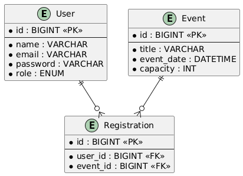


## 7. Diagramy [SŻ]
**Diagram Przypadków Użycia:**
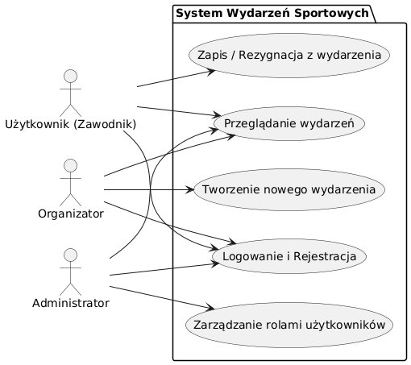
**Scenariusz dla przypadku: Tworzenie nowego wydarzenia**
* **Aktor Główny:** Organizator
* **Warunek wstępny:** Użytkownik jest zalogowany i posiada rolę "Organizator".
* **Kroki:**
  1. Organizator wybiera opcję "Dodaj Wydarzenie".
  2. System wyświetla pusty formularz.
  3. Organizator wypełnia pola: nazwa, data, limit miejsc i klika "Utwórz".
  4. System weryfikuje poprawność danych (np. czy limit > 0).
  5. System zapisuje wydarzenie w bazie i wyświetla komunikat o sukcesie.
* **Scenariusz alternatywny (Błąd walidacji):** W kroku 4, jeśli dane są błędne, system przerywa operację i wyświetla komunikaty o błędach nad formularzem.

**Diagram Klas:**
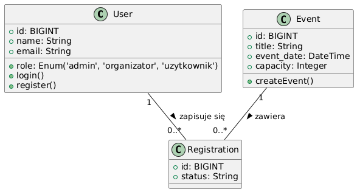

**Diagram Sekwencji:**
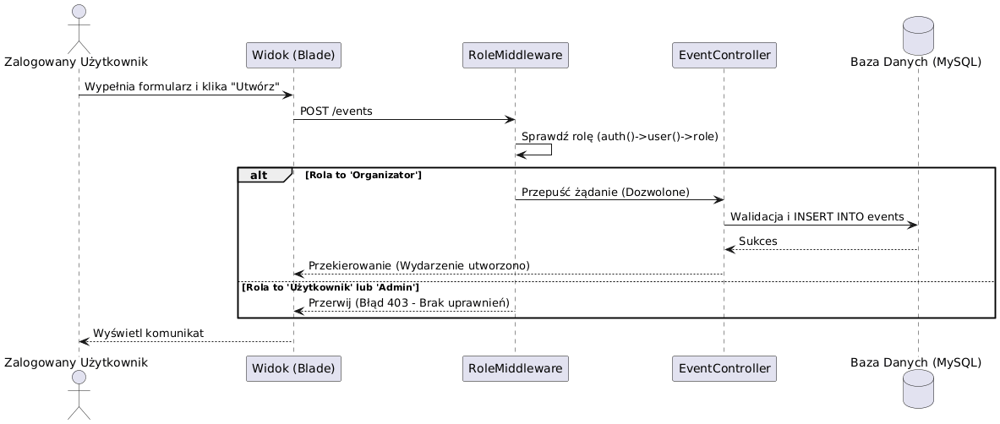

**Diagram Aktywności:**
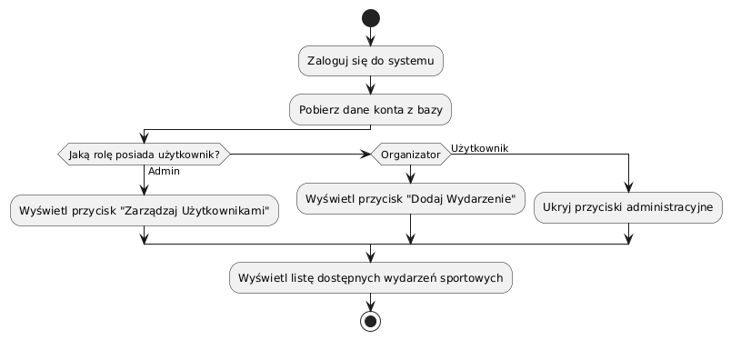

**Diagram Stanów:**
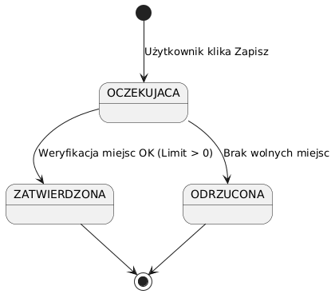

## 8. Bezpieczeństwo i Dostępność [SŻ]
* **Privacy by Design:** System gromadzi wyłącznie minimalny zestaw danych niezbędny do działania (imię, email) zgodnie z zasadą minimalizacji danych. Użytkownik ma pełną kontrolę nad swoimi danymi.
* **Secure by Design:** Laravel używa mechanizmu PDO, eliminując ryzyko ataków SQL Injection. Hasła są bezpiecznie hashowane algorytmem Bcrypt przed zapisem do bazy.
* **Zero Trust w praktyce:** Trasy (routing) są chronione nie tylko przed niezalogowanymi użytkownikami (middleware `auth`), ale również mechanizmem Role-Based Access Control (RBAC). Stworzono dedykowany middleware, który weryfikuje rolę przy każdym żądaniu HTTP. Dzięki temu np. operacja `POST /events` zostanie bezwzględnie odrzucona (błąd 403), jeśli wywoła ją zwykły zawodnik lub Administrator. Projekt uwzględnia zasadę ograniczonego zaufania (Zero Trust) w samej strukturze oprogramowania.
* **WCAG:** Aplikacja wspiera standard WCAG 2.1. Zastosowano semantyczny kod HTML5 oraz zapewniono wysoki kontrast elementów interaktywnych (przycisków). Aplikację można w pełni obsługiwać za pomocą klawiatury (klawisz Tab).

## 9. Przypadki Testowe i Testy Jednostkowe [SŻ]
**Przypadki testowe (manualne):**

| ID | Nazwa testu | Warunki wstępne | Kroki do wykonania | Oczekiwany rezultat |
| :--- | :--- | :--- | :--- | :--- |
| **TC-01** | Dodanie wydarzenia | Użytkownik zalogowany z rolą Organizator | 1. Kliknij "+ Dodaj Wydarzenie"<br>2. Wypełnij Tytuł, Datę i Limit<br>3. Kliknij "Utwórz" | Pojawia się zielony komunikat o sukcesie, wydarzenie jest widoczne na liście na Dashboardzie. |
| **TC-02** | Zapis na wydarzenie | Zalogowany, wydarzenie ma wolne miejsca | 1. Znajdź wydarzenie na liście<br>2. Kliknij "Zapisz się" | Pojawia się komunikat o sukcesie, licznik miejsc wzrasta o 1, przycisk zmienia się na "Wypisz się". |

**Testy jednostkowe (PHPUnit):**
```php
<?php
namespace Tests\Unit;
use PHPUnit\Framework\TestCase;
use App\Models\Event;

class EventTest extends TestCase
{
    // Test 1: Sprawdzenie czy wydarzenie poprawnie się inicjuje
    public function test_event_can_be_instantiated_with_capacity()
    {
        $event = new Event();
        $event->title = "Bieg Wiosenny";
        $event->capacity = 50;

        $this->assertEquals("Bieg Wiosenny", $event->title);
        $this->assertEquals(50, $event->capacity);
    }

    // Test 2: Sprawdzenie logiki dostępności miejsc
    public function test_event_has_available_spots()
    {
        $event = new Event();
        $event->capacity = 10;
        $registeredUsersCount = 5; // Symulacja pobrania z bazy

        $hasSpots = ($event->capacity - $registeredUsersCount) > 0;

        $this->assertTrue($hasSpots);
    }
}
```

**Rezultat wywołania testów:**
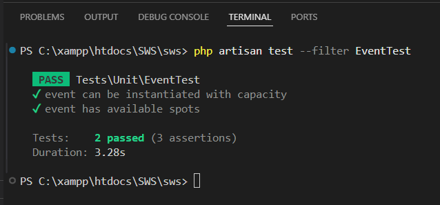

## 10. Diagram Komponentów, Instalacja i CI/CD [SŻ]
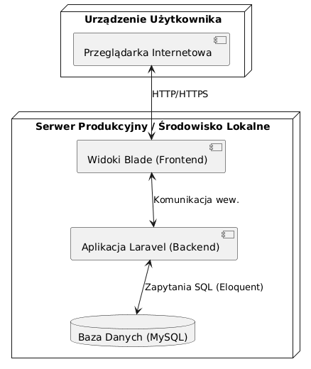
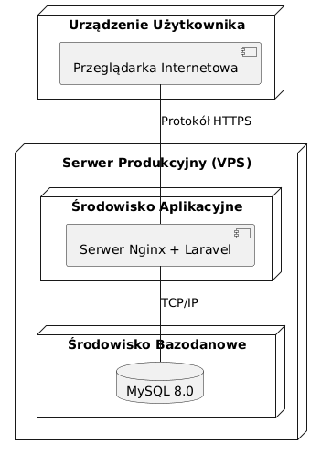

System korzysta z GitHub Actions do automatycznego testowania kodu (Continuous Integration).

**Plik .github/workflows/tests.yml:**
```yaml
name: Laravel Tests
on: [push, pull_request]
jobs:
  test:
    runs-on: ubuntu-latest
    steps:
    - uses: actions/checkout@v3
    - name: Setup PHP
      uses: shivammathur/setup-php@v2
      with:
        php-version: '8.2'
    - name: Install Dependencies
      run: composer install -q --no-ansi --no-interaction --no-scripts --no-progress --prefer-dist
    - name: Execute tests via PHPUnit
      run: vendor/bin/phpunit
```

W środowisku deweloperskim uruchomienie następuje poprzez sekwencję komend: `composer install`, `npm install && npm run build`, `php artisan migrate` oraz włączenie serwera za pomocą `php artisan serve`.

## 11. Podręcznik Użytkownika [SŻ]
**Spis treści podręcznika:**
1. Wstęp
2. Tworzenie konta i logowanie
3. Zarządzanie wydarzeniami
   3.1. Dodawanie nowego wydarzenia (Rola: Organizator)
   3.2. Przeglądanie listy wydarzeń
4. Partycypacja w wydarzeniach
   4.1. Zapisywanie się na wydarzenie
   4.2. Rezygnacja z udziału
5. Administracja systemem
   5.1. Zarządzanie rolami użytkowników (Rola: Admin)

**Sekcja 3.1. Dodawanie nowego wydarzenia**
Aby dodać nowe wydarzenie, zaloguj się do systemu kontem z rolą Organizatora i przejdź do widoku głównego (Dashboard). W górnej części ekranu znajdź i kliknij zielony przycisk `+ Dodaj Wydarzenie`. Zostaniesz przeniesiony do formularza. Wypełnij wymagane pola: podaj czytelną nazwę, wybierz datę z systemowego kalendarza oraz określ maksymalny limit uczestników (musi to być liczba większa od zera). Po upewnieniu się, że dane są poprawne, kliknij niebieski przycisk `Utwórz wydarzenie`. System potwierdzi operację stosownym komunikatem, a nowe wydarzenie natychmiast pojawi się w katalogu.
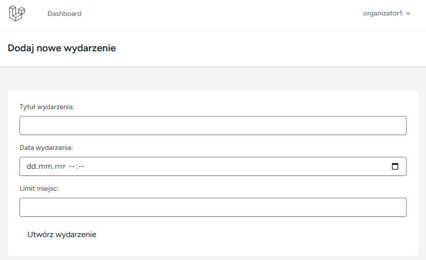

**Sekcja 4.1. Zapisywanie się na wydarzenie**
Zapisy na wydarzenia są niezwykle proste. Na głównym ekranie zlokalizuj interesujące Cię wydarzenie w tabeli. Sprawdź kolumnę `Miejsca`, aby upewnić się, że limit uczestników nie został wyczerpany. Jeśli miejsca są dostępne, w kolumnie `Akcja` kliknij przycisk `Zapisz się`. System automatycznie przypisze Twoje konto do listy startowej i zaktualizuje licznik wolnych miejsc. Przycisk zmieni swój kolor i etykietę na `Wypisz się`, co umożliwi Ci ewentualną rezygnację w przyszłości.
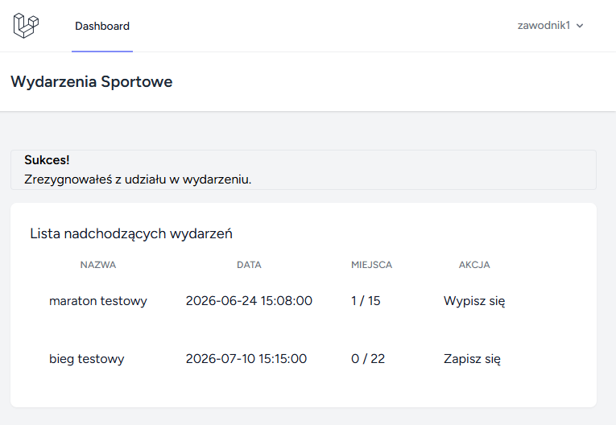

**Sekcja 5.1. Zarządzanie rolami użytkowników**
Logując się na konto o uprawnieniach Administratora, zyskujesz dostęp do dedykowanego panelu sterowania. Na stronie głównej kliknij fioletowy przycisk `Zarządzaj Użytkownikami (Admin)`. Ukaże się zestawienie wszystkich zarejestrowanych kont. Aby zmienić uprawnienia wybranej osoby, zlokalizuj jej wiersz w tabeli, wybierz z listy rozwijanej odpowiednią rolę (Użytkownik, Organizator lub Admin), a następnie potwierdź wybór niebieskim przyciskiem `Zapisz`. Zmiany są uwzględniane w systemie natychmiastowo.
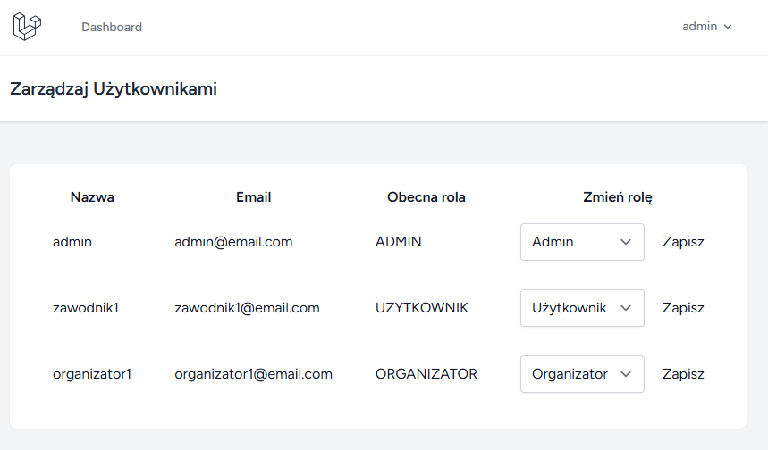